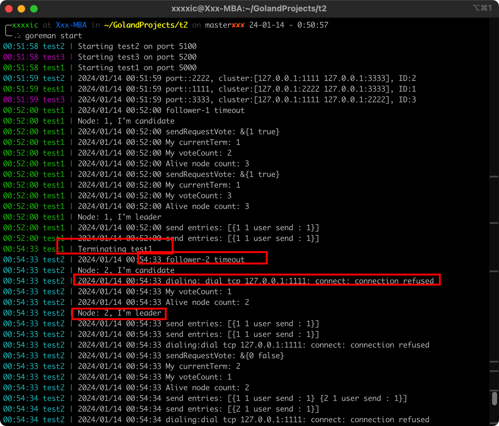
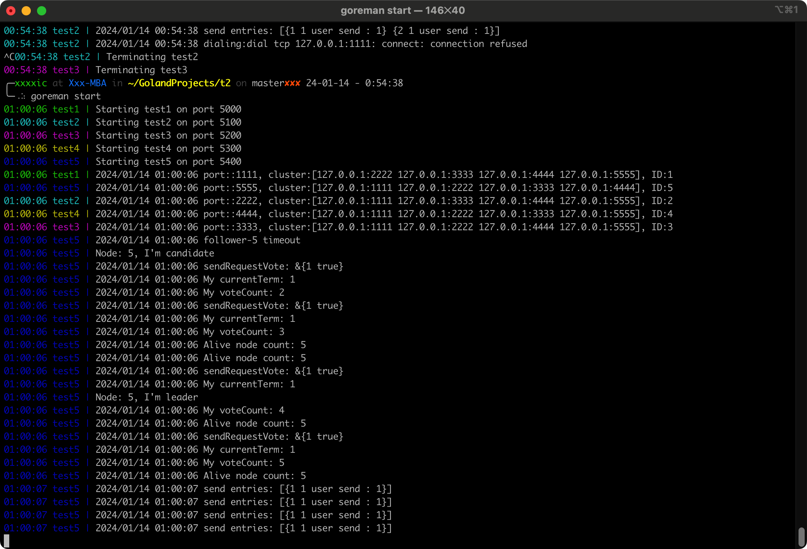

# Basic-Raft-Implement

> Homework of Computer_Architecture

## 环境

+ GO版本: 1.20 
+ 系统: MacOS 12.6.7
+ 处理器: Apple M1

## 运行方法

### build

编译打包Go项目：`go build -o raftTest`

### run

注意：因为 goreman 是基于golang的，所以需要先安装golang和配置环境。

安装多进程管理工具goreman：`go install github.com/mattn/goreman@latest`

查看帮助：`goreman help`

启动测试：`goreman start`

手动停止进程：`goreman run stop [ProcessName]`

## 运行结果

